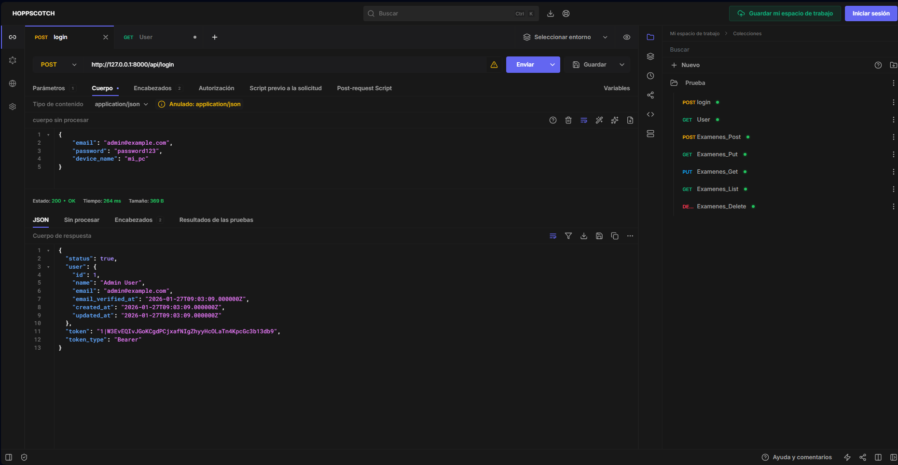
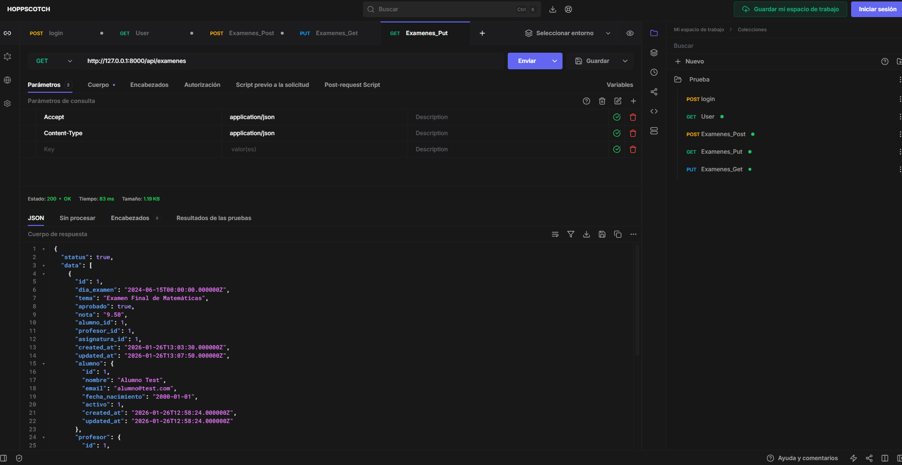
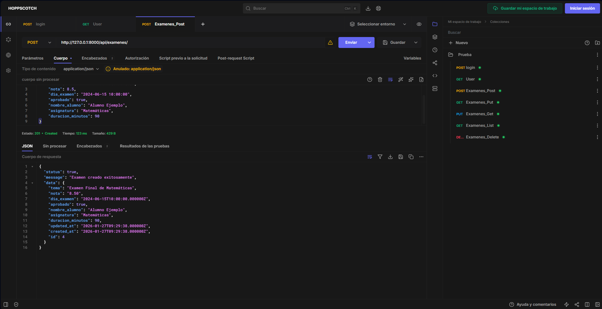
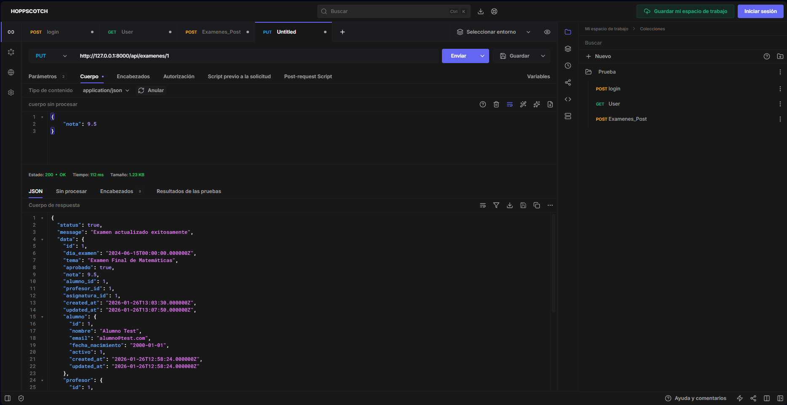
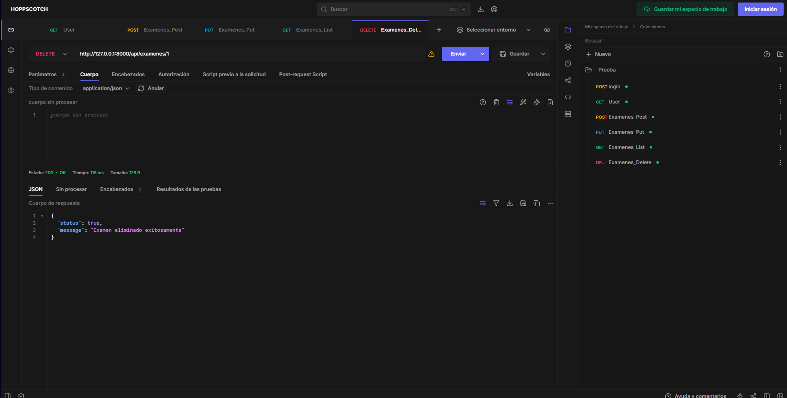

# API RESTful de Gestión de Cursos - Laravel + Sanctum

Sistema completo de API RESTful segura para la gestión de cursos, con autenticación basada en tokens, roles de usuario y operaciones CRUD, construido con **Laravel 11/12** y **Laravel Sanctum**, siguiendo estrictas prácticas de seguridad y arquitectura moderna.


## Descripción

Esta aplicación implementa un backend robusto para un sistema educativo. Permite a los administradores gestionar el ciclo de vida de **Alumnos, Profesores, Asignaturas y Exámenes**, mientras que los usuarios autenticados pueden consultar información y gestionar su propio perfil de forma segura.

---

## Capturas de Pantalla

*(Espacio reservado para tus capturas de Postman o de la Web de Prueba)*

### 1. Login y Obtención de Token
Autenticación segura devolviendo token Bearer.


### 2. Gestión de Perfil de Usuario
Endpoint protegido donde el usuario modifica sus propios datos.


### 3. CRUD de Exámenes
Operaciones completas de gestión académica (Puede probarse con Postman o Hoppscotch).

#### A. Listar Exámenes (GET)


#### B. Crear Examen (POST)


#### C. Actualizar Examen (PUT)


#### D. Eliminar Examen (DELETE)


---

## Arquitectura del Proyecto

El proyecto sigue la arquitectura estándar de **Laravel**, separando claramente rutas, controladores y modelos:

```
api-cursos/
├── app/
│   ├── Http/
│   │   ├── Controllers/           # Lógica de Negocio
│   │   │   ├── Api/
│   │   │   │   ├── AuthController.php      # Login, Registro, Perfil
│   │   │   │   ├── AlumnoController.php    # CRUD Alumnos
│   │   │   │   ├── ProfesorController.php  # CRUD Profesores
│   │   │   │   ├── ExamenController.php    # CRUD Exámenes
│   │   │   │   └── AsignaturaController.php# CRUD Asignaturas
│   │   └── Middleware/            # Filtros de Seguridad (Sanctum)
│   ├── Providers/
│   │   └── AppServiceProvider.php # Configuración Global (Rate Limiter Fix)
│   │
│   └── Models/                    # ORM Eloquent
│       ├── User.php               # Usuarios del sistema
│       ├── Alumno.php             # Entidad Académica
│       ├── Examen.php             # Entidad Académica (con relaciones)
│       └── ...
│
├── database/                      # Estructura de Datos
│   ├── migrations/                # Definición de tablas
│   └── seeders/                   # Datos de prueba
│       ├── DatabaseSeeder.php     # Orquestador principal
│       ├── UserSeeder.php         # Admin por defecto
│       ├── AlumnoSeeder.php       # Datos falsos de Alumnos
│       ├── ProfesorSeeder.php     # Datos falsos de Profesores
│       └── AsignaturaSeeder.php   # Datos falsos de Asignaturas
│
├── routes/
│   └── api.php                    # Definición de Endpoints Seguros
│
├── hoppscotch_export/             # 🧪 Colección de Pruebas
│   └── Prueba.json                # Archivo para importar en Hoppscotch
│
└── public/
    └── test_api.html              # Cliente web ligero para pruebas
```

### Flujo de la Aplicación

```
┌─────────────────────────────┐
│      Petición HTTP          │
│  (Postman / Frontend / App) │
└──────────────┬──────────────┘
               │
               ▼
┌─────────────────────────────┐
│      routes/api.php         │
│    (Enrutamiento Seguro)    │
└──────────────┬──────────────┘
               │
               ▼
┌─────────────────────────────┐       ┌────────────────────────┐
│   Middleware y Seguridad    │ ◀──── │   Base de Datos        │
│ (Sanctum + Rate Limiter)    │       │ (personal_access_tokens)│
└──────────────┬──────────────┘       └────────────────────────┘
               │
               ▼
┌─────────────────────────────┐
│       Controladores         │
│   (Validación y Lógica)     │
└──────────────┬──────────────┘
               │
               ▼
┌─────────────────────────────┐       ┌────────────────────────┐
│      Modelos (Eloquent)     │ ◀───▶ │   Base de Datos        │
│     (Acceso a Datos)        │       │      (MySQL)           │
└─────────────────────────────┘       └────────────────────────┘
```

---

## Características de Seguridad Implementadas

### 1. Autenticación con Laravel Sanctum
Uso de tokens para asegurar la comunicación sin estado (Stateless). Cada petición debe incluir el cabezal `Authorization: Bearer <token>`.

**Archivo:** `routes/api.php`
```php
Route::middleware('auth:sanctum')->group(function () {
    Route::apiResource('examenes', ExamenController::class);
    // ...
});
```

### 2. Validación Estricta (Backend)
Todos los datos entrantes son validados antes de procesarse para asegurar integridad y evitar inyecciones.

**Archivo:** `app/Http/Controllers/Api/ExamenController.php`
```php
$validator = Validator::make($request->all(), [
    'dia_examen' => 'required|date_format:Y-m-d',
    'tema' => 'required|string|max:255',
    'nota' => 'nullable|numeric|min:0|max:10' // Validación de rango
]);
```

### 3. Protección de Datos Sensibles
Los usuarios solo pueden modificar su propio perfil. La lógica impide modificar datos de otros IDs.

**Archivo:** `app/Http/Controllers/Api/AuthController.php`
```php
public function updateProfile(Request $request) {
    $user = $request->user(); // Obtiene el usuario DEL TOKEN, no por ID en URL
    // ... lógica de actualización
}
```

### 4. Relaciones Protegidas (Integridad Referencial)
Uso de claves foráneas y restricciones en base de datos para evitar datos huérfanos.

**Archivo:** `database/migrations/...create_examens_table.php`
```php
$table->foreignId('alumno_id')->constrained()->onDelete('cascade');
```

### 5. Protección contra Fuerza Bruta (Rate Limiting)
Limitación de peticiones por minuto para prevenir ataques de denegación de servicio (DoS). Implementado globalmente para la API.

**Archivo:** `app/Providers/AppServiceProvider.php`
```php
RateLimiter::for('api', function (Request $request) {
    return Limit::perMinute(60)->by($request->user()?->id ?: $request->ip());
});
```

---

## Guía de Pruebas

Para verificar el funcionamiento de la API, se recomienda utilizar herramientas estándar como **Postman** o **Hoppscotch**.

### OPCIÓN 1: Postman (Recomendada)
1.  Importa la colección o crea una nueva Request.
2.  **Login**: POST a `/api/login` con Body JSON `{"email": "admin@example.com", "password": "password123"}`.
3.  **Copia el Token** de la respuesta.
4.  **Otras peticiones**: En la pestaña *Authorization*, selecciona **Bearer Token** y pega el token copiado.

### OPCIÓN 2: Hoppscotch (Web) - ¡Método Fácil! ✨

Hemos incluido una colección configurada para que no tengas que escribir nada.

#### A. Importar (Rápido)
1.  Ve a [Hoppscotch.io](https://hoppscotch.io/).
2.  Instala la extensión del navegador (necesaria para `localhost`).
3.  Clic en **Colecciones** (Icono carpeta) > **Importar** > **Desde archivo JSON**.
4.  Selecciona el archivo: `hoppscotch_export/Prueba.json`.
5.  ¡Listo! Ya tienes todas las peticiones (Login con `device_name`, Headers, CRUD...) configuradas.

#### B. Manual
Si prefieres hacerlo a mano, recuerda estos **3 puntos clave** para que no falle:
1.  **Headers Obligatorios** (¡Pon los dos!):
    *   `Content-Type: application/json`
    *   `Accept: application/json`
2.  **Campo Extra en Login**: Añade `"device_name": "mi_pc"` en el JSON.
3.  **Token**: Copia el token del login y úsalo como `Bearer Token` en las demás peticiones.


---
### 1. Requisitos
*   PHP 8.2 o superior.
*   Composer.
*   Servidor MySQL/MariaDB.

### 2. Instalación
```bash
# 1. Instalar dependencias
composer install

# 2. Configurar entorno
cp .env.example .env
# (Configura DB_DATABASE, DB_USERNAME, etc en el archivo .env)

# 3. Generar clave de aplicación
php artisan key:generate

# 4. Migrar base de datos y sembrar datos de prueba
php artisan migrate --seed
```

### 3. Usuarios de Prueba
Al ejecutar los seeders, se crea el siguiente usuario por defecto en `database/seeders/UserSeeder.php`:

| Rol       | Email               | Contraseña    |
| :-------- | :------------------ | :------------ |
| **Admin** | `admin@example.com` | `password123` |

---

## Tecnologías Utilizadas

| Tecnología     | Versión | Uso                      |
| :------------- | :------ | :----------------------- |
| **Laravel**    | 11.x    | Framework Backend        |
| **PHP**        | 8.2+    | Lenguaje del Servidor    |
| **Sanctum**    | Latest  | Autenticación de API     |
| **MariaDB**    | 10.x    | Base de Datos Relacional |
| **phpMyAdmin** | -       | Gestión de Base de Datos |
| **Postman**    | -       | Herramienta de Testing   |
| **Hoppscotch** | -       | Herramienta de Testing   |

---

## Referencias

- [Laravel Documentation](https://laravel.com/docs)
- [Laravel Sanctum](https://laravel.com/docs/sanctum)
- [API RESTful y CRUD Laravel (Notion)](https://charmed-group-fc8.notion.site/API-RESTful-y-CRUD-Laravel-2ed60ff317c980e49178df5a9969d930)
